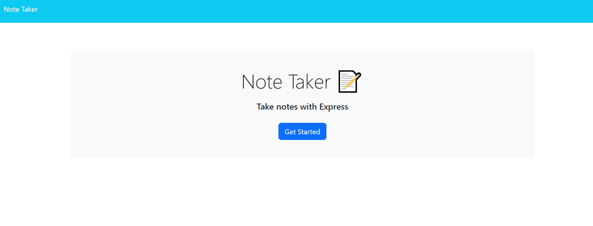
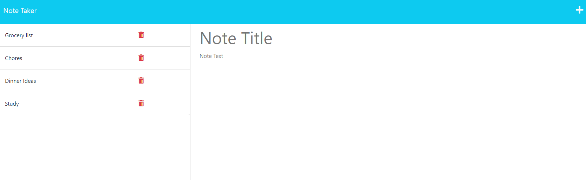
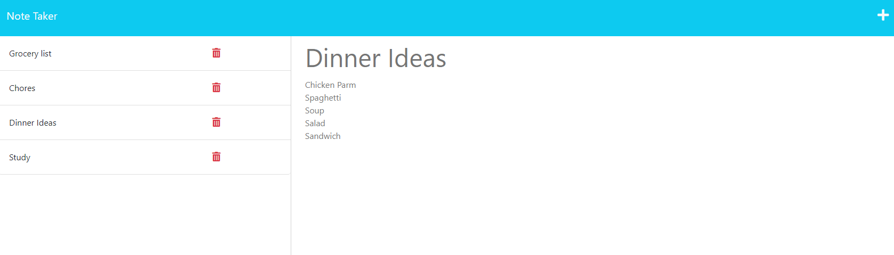

  # Readme Generator

## Table of Content 

- [Description](#description)
- [Installation](#installation)
- [License](#license)
- [Contributing](#contributing)
- [Tests](#tests)
- [Questions](#questions)

## Description 
This is a Note Taker

## Installation 
NA

## Usage 
When a user clicks on 'Get Started' it will take the user to a second page where user can type in the note title and notes below of things that need to be done or get accomplished for the week. 

## License 
MIT

## Contributing 
Linh Lien

## Tests 
NA

## Questions 
Email: Lienx149@gmail.com 

Github Profile: [Github](https://github.com/Liex149)